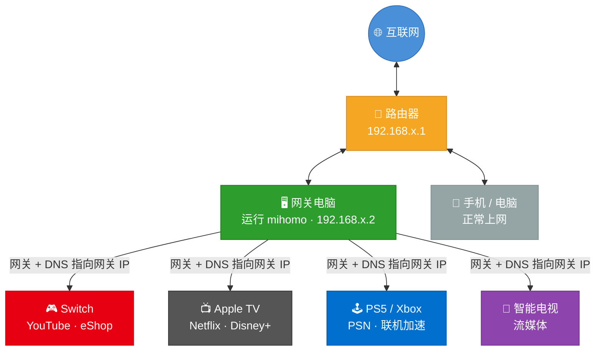
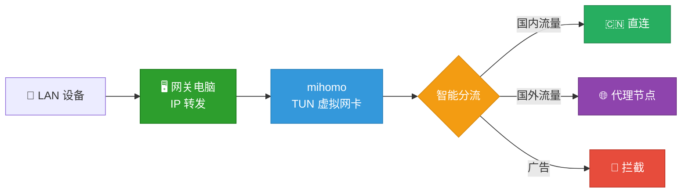

# LAN Proxy Gateway

[English](README_EN.md)

[](https://github.com/Tght1211/lan-proxy-gateway/releases)
[](https://github.com/Tght1211/lan-proxy-gateway/stargazers)
[](LICENSE)
[](https://go.dev/)

把你的电脑变成一台局域网透明代理网关。  
不刷路由器、不买软路由，`Switch / PS5 / Apple TV / 智能电视 / 手机` 改个网关和 DNS 就能用。

这个项目基于 `mihomo`，重点做两件事：

- `局域网共享`：让不能装代理 App 的设备也能走透明代理
- `链式代理`：让 Claude / ChatGPT / Codex / Cursor 更适合走住宅出口

> 完全开源，中文优先，主要用于网络与代理技术学习、家庭网关实践和菜单式 CLI 交互探索。



## 核心能力

### 1. 局域网透明共享

- 设备改网关和 DNS 即可接入
- 支持 `Switch / PS5 / Apple TV / 智能电视 / 手机 / 平板`
- 支持 `TUN` 模式和 `本机绕过代理`

### 2. Chains 链式代理

```text
你的设备 -> 机场节点 -> 住宅代理 -> Claude / ChatGPT / Codex / Cursor
```

适合：

- Claude / ChatGPT 注册和使用
- Codex / Cursor 等 AI 编程工具
- 日常流量走机场，AI 流量走住宅出口

### 3. 运行中控制台

默认执行 `gateway start` 会直接进入菜单式 CLI 控制台。启动后就是首页菜单，不需要再像 MySQL 一样先进去再记一堆命令。

菜单里现在可以直接完成这些高频操作：

- 查看运行状态和当前配置摘要
- 切换策略组与节点，并支持重新测速排序
- 管理订阅、代理来源和订阅名称
- 切换 TUN、本机绕过代理和推荐规则
- 管理 `chains / script / off` 和住宅代理参数
- 打开完整配置中心
- 查看设备接入说明、日志和升级提示

交互方式：

- 启动后直接显示首页菜单，按编号进入子菜单
- 每个工作台都带当前摘要和固定菜单，不依赖隐藏命令
- `gateway console` 可以随时重新进入同一套菜单控制台
- 旧版 `--tui` 入口已移除，传入时会直接提示改用默认控制台

### 4. 规则系统

默认内置：

- 局域网和保留地址直连
- 国内常见服务直连
- Apple / Nintendo 相关规则
- 广告与跟踪域名拦截
- 国外网站和 AI 服务代理

## 3 分钟快速开始

### 第 1 步：安装

先把 `gateway` 装到本机。中国大陆网络优先用 CDN 入口。

#### macOS / Linux

推荐：

```bash
curl -fsSL https://cdn.jsdelivr.net/gh/Tght1211/lan-proxy-gateway@main/install.sh | bash
```

备用：

```bash
curl -fsSL https://raw.githubusercontent.com/Tght1211/lan-proxy-gateway/main/install.sh | bash
```

#### Windows PowerShell

推荐：

```powershell
irm https://cdn.jsdelivr.net/gh/Tght1211/lan-proxy-gateway@main/install.ps1 | iex
```

备用：

```powershell
irm https://raw.githubusercontent.com/Tght1211/lan-proxy-gateway/main/install.ps1 | iex
```

如果你所在网络直连 GitHub 不稳定，也可以手动指定镜像：

```bash
GITHUB_MIRROR=https://hub.gitmirror.com/ bash install.sh
```

安装脚本现在会优先快速探测可用下载源，并在持续低速时自动切换候选源；如果你所在网络环境比较特殊，手动指定镜像仍然是最稳的方式。

### 第 2 步：初始化配置

```bash
gateway install
```

安装向导会依次完成：

1. 自动下载官方 `mihomo` 内核（Windows x86_64 会下载官方 zip 并安装为本地 `mihomo.exe`）
2. 录入订阅链接或本地配置文件
3. 生成 `gateway.yaml`

如果你只想最快跑起来，按提示填完这三个信息就够了：

- 代理来源
- 订阅链接或本地配置文件
- 订阅名称

### 第 3 步：启动网关

**macOS / Linux：**

```bash
sudo gateway start
```

**Windows（需以管理员身份运行终端）：**

```powershell
gateway start
```

补充说明：

- `gateway update` 在 Windows 下会走后台替换流程，当前 `.exe` 退出后自动完成更新并重新启动网关
- `gateway service install` 在 Windows 下会安装开机自启任务，不需要把 CLI 伪装成 `sc.exe` 服务

默认模式下，启动成功后会直接进入菜单式 CLI 控制台，终端会显示：

- 当前节点、代理来源、TUN 和扩展模式摘要
- 节点 / 订阅 / 网络 / 规则 / 扩展 / 配置中心等菜单入口
- 日志、设备接入说明和升级提示入口

这套控制台优先解决“直接选菜单就能改配置”，而不是要求你记住一批运行中命令。

这一步里最重要的是记住你的局域网 IP。

如果你退出了控制台，之后可以随时重新进入：

```bash
# macOS / Linux
sudo gateway console

# Windows（管理员终端）
gateway console
```

### 第 4 步：让其他设备接入

把设备的：

- `网关 (Gateway)` 改成你电脑的局域网 IP
- `DNS` 改成同一个 IP

如果你只想先验证一次，优先拿这几类设备测试：

- [iPhone / Android](docs/phone-setup.md)
- [Nintendo Switch](docs/switch-setup.md)
- [PS5](docs/ps5-setup.md)
- [Apple TV](docs/appletv-setup.md)
- [智能电视](docs/tv-setup.md)

### 第 5 步：确认是否成功

```bash
gateway status
```

你会看到：

- 当前节点
- 入口节点
- 普通出口
- 住宅出口（如果开启了 chains）

## 常用命令

> Windows 用户：以下带 `sudo` 的命令需在**管理员终端**中去掉 `sudo` 运行，例如 `sudo gateway start` → `gateway start`。

| 命令 | 说明 |
|---|---|
| `gateway install` | 初始化向导 |
| `gateway config` | 交互式配置中心 |
| `sudo gateway start` | 启动网关并进入菜单式 CLI 控制台 |
| `sudo gateway console` | 不重启网关，重新进入菜单式 CLI 控制台 |
| `gateway tun on` | 开启 TUN 透明代理 |
| `gateway tun off` | 关闭 TUN 透明代理 |
| `gateway status` | 查看运行状态和出口网络 |
| `gateway chains` | 链式代理向导 |
| `gateway switch` | 切换代理来源和扩展模式 |
| `gateway skill` | 查看 AI skill 信息 |
| `gateway permission install` | 安装免密控制权限（仅 macOS/Linux） |
| `sudo gateway service install` | 安装开机自启（Windows 下底层使用计划任务） |
| `sudo gateway update` | 升级到最新版 |

完整命令见 [docs/commands.md](docs/commands.md)。

## 本地开发

仓库根目录现在带了一个本地开发脚本 `dev.sh`，用来统一处理编译、测试和本地运行。
适合 `macOS / Linux` 终端环境：

```bash
./dev.sh build
./dev.sh test
./dev.sh test-core
./dev.sh run -- --version
./dev.sh start
```

说明：

- `build` 会把开发二进制编译到 `.tmp/gateway-dev`
- `test` 跑 `go test ./...`
- `test-core` 只跑这次日常最常用的一组核心包
- `run -- <参数>` 会先编译，再把参数原样传给本地二进制
- `start / console / stop / restart` 会先本地编译，再在运行阶段按需使用 `sudo`
- Go build cache 默认放在仓库内 `.cache/go-build`，避免本机全局缓存权限把开发流程卡住

## 工作原理



1. 电脑开启 IP 转发，充当局域网网关
2. `mihomo` 以 TUN 模式接管流量
3. 规则系统决定直连、代理或拦截
4. chains 模式下，AI 流量还能继续接到住宅出口

## 文档导航

- [命令总览](docs/commands.md)
- [进阶配置](docs/advanced.md)
- [常见问题](docs/faq.md)
- [版本规划](docs/versioning.md)
- [Switch 配置](docs/switch-setup.md)
- [PS5 配置](docs/ps5-setup.md)
- [Apple TV 配置](docs/appletv-setup.md)
- [手机配置](docs/phone-setup.md)

## 和 Clash Verge 的“允许局域网连接”有什么区别

| 对比项 | Clash Verge 局域网代理 | LAN Proxy Gateway |
|---|---|---|
| 代理层级 | 应用层代理 | 网络层透明代理 |
| 设备配置方式 | 填代理服务器地址 | 改网关和 DNS |
| Switch / Apple TV / PS5 | 部分场景受限 | 更适合整机透明接管 |
| App 是否感知代理 | 往往能感知 | 更接近真实网关 |
| 典型使用方式 | 单设备代理 | 全屋设备共享 |

## 开源说明

本项目完全开源，主要用于：

- 网络与代理技术学习
- 家庭局域网网关实践
- TUN / 透明代理 / 分流规则研究
- AI 客户端与菜单式 CLI 交互设计探索

请在你所在地区法律法规允许的前提下使用。

## License

[MIT](LICENSE)
