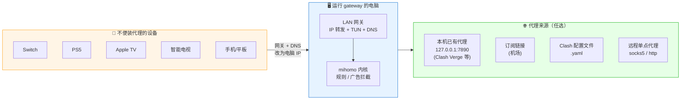
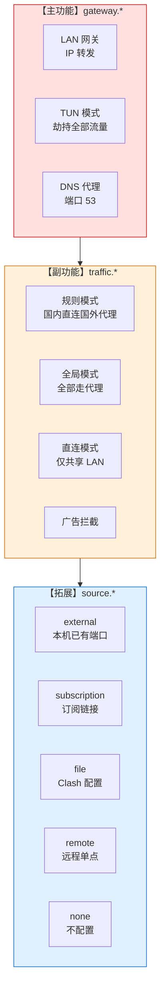

# LAN Proxy Gateway

[](https://go.dev/)
[](https://github.com/Tght1211/lan-proxy-gateway/releases)
[](LICENSE)
[]()

> **把电脑变成局域网代理网关** —— 让不方便装代理 App 的设备（Switch / PS5 / Apple TV / 智能电视 / 手机）**改个网关 + DNS** 就能科学上网。

面向**非编程玩家**：一键安装、3 步配置向导、全程中文菜单。

---

## 🚀 一键安装

### macOS / Linux

```bash
curl -fsSL https://raw.githubusercontent.com/Tght1211/lan-proxy-gateway/main/install.sh | bash
```

### Windows（管理员 PowerShell）

```powershell
irm https://raw.githubusercontent.com/Tght1211/lan-proxy-gateway/main/install.ps1 | iex
```

> 🌏 国内访问 GitHub 慢？脚本会自动尝试镜像（`hub.gitmirror.com` / `ghproxy.com` / `moeyy.xyz` / `ddlc.top`），也可以手动指定：
> ```bash
> GITHUB_MIRROR=https://你的镜像/ bash install.sh
> ```

安装完成后，**管理员身份**运行一次：

```bash
sudo gateway install    # Mac/Linux：下载 mihomo + 3 步向导
gateway install         # Windows：在管理员 PowerShell 里跑
```

---

## 🎯 一图看懂



**核心思路**：电脑只要能科学上网（哪怕已经在跑 Clash Verge / Shadowrocket），把它变成网关就能让整屋设备一起享受，**不需要再配第二份订阅**。

---

## 🧩 三层架构



| 层级 | 能力 | 配置键 |
|---|---|---|
| **主功能** | LAN 网关（IP 转发 + TUN + DNS） | `gateway.*` |
| **副功能** | 流量控制（规则 / 全局 / 直连 + 广告拦截） | `traffic.*` |
| **拓展** | 代理端口（本机已有 / 订阅 / 文件 / 远程 / 无） | `source.*` |

---

## 📋 首次配置向导

```
步骤 1 / 3  局域网网关
──────────────────────────────────
  启用 LAN 共享网关？(Y/n)
  启用 TUN？           (Y/n)    ← 让 Switch/PS5 也能走代理的关键
  启用 DNS 代理？      (Y/n)

步骤 2 / 3  流量控制模式
──────────────────────────────────
  1) 规则模式 (推荐)    国内直连 + 国外代理
  2) 全局模式           全部走代理
  3) 直连模式           不代理，仅 LAN 共享
  开启广告拦截？ (Y/n)

步骤 3 / 3  代理端口来源
──────────────────────────────────
  1) 本机已有代理端口   ← 已经在跑 Clash Verge 的用户选这个
  2) 订阅链接           填入机场 URL
  3) Clash 配置文件     选本地 .yaml
  4) 远程单点代理       socks5 / http
  5) 暂不配置
```

向导结束后会写入 `~/.config/lan-proxy-gateway/gateway.yaml`（Windows 在 `%APPDATA%\lan-proxy-gateway\`），并打印设备接入指引。

---

## 📱 让其他设备接入

把设备的：

- **网关 (Gateway)** 改成运行 `gateway` 的电脑的**局域网 IP**
- **DNS 服务器** 改成**同一个 IP**

保存后重连网络即可。

> ### ⚠️ 前提一：TUN 必须开启
>
> 光改网关让流量"流经电脑"还不够 —— 电脑默认只做**普通路由转发**，Switch/PS5 照样被墙。
> **TUN 才是劫持并让流量走代理的关键**。
>
> 因此本项目 TUN 默认开启，不建议关闭。
> 只有当你**仅给手机/电脑用、并愿意手动填代理服务器 = 本机IP:7890**时才能关 TUN —— 这种场景下 Switch/PS5 接入不了代理。
>
> ### ⚠️ 前提二：DNS 代理
>
> | 场景 | 设备的 DNS 设置 |
> |---|---|
> | 本机 DNS 代理【开】（默认） | 指向本机 IP（省事） |
> | 本机 DNS 代理【关】（如 Clash Verge 已占 :53） | 可继续指向本机 IP（由占用方回答），或改成 `114.114.114.114` |
> | 本机 DNS 代理关 **且** 本机 :53 没人接管 | 设备必须单独设一个能用的 DNS，否则**完全断网** |
>
> TUN 模式下关 DNS 会让 fake-ip 失效，劫持可能不完整。不确定就保持默认开着。

---

## 🖥️ 常用命令

所有操作都可以在**主菜单**里完成，不用记命令。下面是无人值守场景用的 cobra 命令：

| 命令 | 作用 |
|---|---|
| `gateway` | 进入主菜单（或 3 步向导） |
| `gateway install` | 下载 mihomo + 首次向导 |
| `gateway start` | 非交互启动（供系统服务调用） |
| `gateway stop` | 停止 |
| `gateway status` | 一次性输出当前状态 |
| `gateway service install` | 安装为开机自启（launchd / systemd / schtasks） |
| `gateway service uninstall` | 卸载系统服务 |
| `gateway service status` | 查看服务状态 |

---

## 🌍 跨平台支持

| 系统 | IP 转发 | NAT | 服务 | 状态 |
|---|---|---|---|---|
| **macOS** | `sysctl net.inet.ip.forwarding=1` | `pfctl` NAT | `launchd` plist | ✅ 主要测试平台 |
| **Linux** | `/proc/sys/net/ipv4/ip_forward` | `iptables MASQUERADE` | `systemd` unit | ✅ 编译 + 单元测试通过 |
| **Windows** | 注册表 `IPEnableRouter=1` | mihomo TUN 虚拟网卡 | `schtasks` 计划任务 | ✅ 编译 + 单元测试通过 |

> Linux / Windows 建议先在小规模局域网验证再推广，遇到问题请开 issue 反馈呐 🐱

---

## ⚙️ 配置文件

完整示例见 [`gateway.example.yaml`](gateway.example.yaml)。最小示例：

```yaml
version: 2

gateway:
  enabled: true
  tun: { enabled: true, bypass_local: false }
  dns: { enabled: true, port: 53 }

traffic:
  mode: rule            # rule | global | direct
  adblock: true
  rulesets:
    china_direct: true
    apple: true
    nintendo: true
    global: true
    lan_direct: true

source:
  type: external        # external | subscription | file | remote | none
  external:
    server: 127.0.0.1
    port: 7890
    kind: http          # http | socks5

runtime:
  ports: { mixed: 7890, redir: 7892, api: 9090 }
```

v1 配置会在首次加载时自动升级到 v2 并打印迁移报告。

---

## 🛠️ 手动编译

```bash
git clone https://github.com/Tght1211/lan-proxy-gateway
cd lan-proxy-gateway

make build           # 编译当前平台到 ./gateway
make install         # 装到 /usr/local/bin/gateway（Mac/Linux，需 sudo）
make test            # 跑全部单元测试
make test-core       # 仅跑核心包测试（更快）
make build-all       # 交叉编译 darwin / linux / windows
```

### 目录结构（v2）

```
cmd/              cobra 入口（5 个命令）
internal/
  app/            统一门面：console + cobra 都调这里
  gateway/        【主】LAN 网关
  traffic/        【副】流量控制 + 内置规则集
  source/         【拓展】代理源（external/subscription/file/remote/none）
  engine/         mihomo 进程 + 渲染 + REST API
  config/         v2 schema + v1 迁移
  platform/       跨平台（darwin/linux/windows）
  console/        菜单式交互
  mihomo/         下载 mihomo 内核
embed/            mihomo yaml 模板
legacy/v1/        v1 源码留档（不参与编译）
```

---

## 🤝 贡献

欢迎 issue / PR！特别是以下方向：

- Linux / Windows 平台的实战反馈
- 新的 ruleset 内置规则
- 翻译 / 英文文档

---

## 📜 License

[MIT](LICENSE) © 2025 [Tght1211](https://github.com/Tght1211)

基于 [mihomo](https://github.com/MetaCubeX/mihomo)（Clash.Meta）内核。

---

## ⭐ Star History

[](https://star-history.com/#Tght1211/lan-proxy-gateway&Date)

如果觉得有用，点个 Star ⭐ 支持一下吧~
