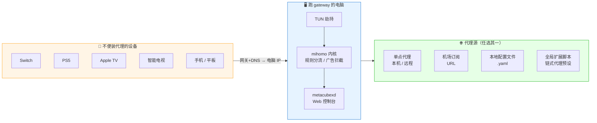
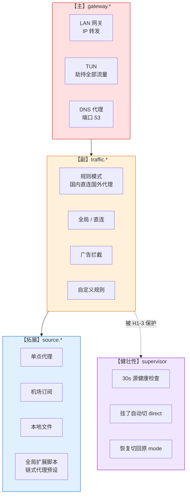

# LAN Proxy Gateway

[](https://go.dev/)
[](https://github.com/Tght1211/lan-proxy-gateway/releases)
[](LICENSE)
[]()

> **把一台电脑变成整屋的代理网关** — Switch / PS5 / Apple TV / iPhone / 智能电视，改个网关 + DNS 就能科学上网，不用每台设备单独装代理 App。

面向**非编程玩家**：一键安装、中文菜单、内嵌 Web 控制台、配置全程引导式。

---

## ✨ 能干什么

- 🏠 **LAN 透明网关** — 基于 mihomo TUN 劫持，家里的 Switch / PS5 / 智能电视只要把网关和 DNS 指向这台电脑就自动走代理
- 📱 **混合代理端口** — 同时开 HTTP + SOCKS5（默认 `17890`，避开 Clash 7890），iPhone / 浏览器 App 直接填当代理
- 🌐 **内嵌 metacubexd Web 控制台** — 浏览器打开 `http://ip:19090/ui/`，切节点 / 改规则 / 看流量一应俱全，手机平板也能进
- ⚡ **自动自愈** — 代理源挂了 30 秒内 supervisor 自动切到直连保命（LAN 不断网），恢复后切回
- 🛡️ **链式代理预设** — 一键填住宅 IP，自动生成「机场起飞 → 住宅 IP 落地」链式代理，AI 相关流量（Claude / OpenAI / Cursor）精准走住宅 IP
- 🎯 **自定义规则 UI** — 菜单里增删 DOMAIN-SUFFIX / IP-CIDR / PROCESS-NAME 规则，优先级盖过内置
- 📊 **节点测速 + 排序** — 进切节点页面自动并发测延迟，按速度升序
- 🗒️ **日志易读视图** — mihomo 英文日志自动翻译成中文简要（`🟡 01:27:55 TCP 直连 xxx → 目标无响应（超时）`）
- 💻 **方式 3 · 本机也走规则** — macOS 一键切本机 DNS 到 `127.0.0.1`，本机浏览器也能按域名分流
- 🔧 **小白友好** — 流量 / 代理 / 规则菜单重分类，右侧白话描述，告警自动重绘

---

## 🚀 一键安装

### macOS / Linux

```bash
curl -fsSL https://raw.githubusercontent.com/Tght1211/lan-proxy-gateway/main/install.sh | bash
```

脚本装完自动进入配置向导（问代理源 → 启动 → 问开机自启），整条流在一个终端里走完。

### Windows（管理员 PowerShell）

```powershell
irm https://raw.githubusercontent.com/Tght1211/lan-proxy-gateway/main/install.ps1 | iex
```

### 国内访问 GitHub 慢？

脚本会按顺序尝试镜像（`hub.gitmirror.com` / `ghproxy.com` / `moeyy.xyz` / `ddlc.top`）。也可以手动指定：

```bash
GITHUB_MIRROR=https://你的镜像/ bash install.sh
```

---

## 🎬 整体架构



**核心思路**：电脑只要能科学上网，把它变网关就能让整屋设备一起享受，**不用每台设备重配一份订阅**。

---

## 📱 三种设备接入方式

### 📺 方式 1 · 改网关（适合 Switch / PS5 / Apple TV / 智能电视）

这类设备**只能填网关 + DNS，不能填代理**，用这个方式：

| 字段 | 填什么 |
|---|---|
| 网关 (Gateway) | 电脑的局域网 IP |
| DNS 服务器 | 同一个 IP |
| 子网掩码 | `255.255.255.0` |
| IP 地址 | 保留 DHCP 或设静态 IP |

保存 → 重连 Wi-Fi，所有流量（YouTube / 游戏 / 各类 App）自动走代理。

### 📱 方式 2 · 填代理（适合 iPhone / 电脑 App / 浏览器插件）

能**手动填代理服务器**的场景：

| 字段 | 填什么 |
|---|---|
| 代理服务器 | 电脑的局域网 IP |
| 端口 | `17890`（HTTP + SOCKS5 混合） |
| 用户名 / 密码 | 留空 |

只走 App 自己发到代理的流量（Switch 填这个没用，Switch 不会主动交给代理）。

### 💻 方式 3 · 本机自己也走规则

gateway 所在电脑的浏览器 / App 也想按 `DomainSuffix,xxx.com,住宅IP` 这种域名规则分流？**必须把本机系统 DNS 改到 `127.0.0.1`**，否则本机查 DNS 直接拿到真 IP，mihomo 只能按 GeoIP 匹配，所有 DOMAIN-SUFFIX 规则失效。

- **macOS 一键**：主菜单 → `1 设备接入指引` → 按 `L`（等同 `sudo networksetup -setdnsservers Wi-Fi 127.0.0.1`）
- **恢复**：同菜单 `R`（或 `sudo networksetup -setdnsservers Wi-Fi empty`）
- **Linux / Windows**：systemd-resolved / NetworkManager / netsh 风格各异，菜单里显示手动命令
- **验证**：`dscacheutil -q host -a name ping0.cc` 返回 `198.18.x.x` 即 fake-ip，DNS 已走 mihomo

### 💡 方式对比

| 方式 | 覆盖面 | 需要 TUN | 适合设备 |
|---|---|---|---|
| 1 改网关 | 所有流量 | ✅ | Switch / PS5 / TV |
| 2 填代理 | 仅支持代理的 App 自己 | ❌ | iPhone / App / 浏览器插件 |
| 3 本机 DNS 切 127.0.0.1 | 本机全部 | ✅ | 跑 gateway 这台电脑自己 |

---

## 🌐 Web 控制台（`metacubexd` 内嵌）

订阅 / 本地文件源时，浏览器打开：

```
http://<电脑局域网 IP>:19090/ui/
```

内置功能：

- 📊 切代理组 / 节点（**自动测延迟 + 颜色标注**）
- 🔄 切换模式（rule / global / direct）
- 📈 实时连接 / 流量统计
- 📜 查规则命中 / 读日志
- ⚙️ 改 mihomo 运行时配置

`metacubexd` 的 dist 已经 `go:embed` 进 binary（2.2 MB），gateway 启动自动释放到 `workdir/ui/`，**开箱即用**，不需要自己 clone UI 仓库。

---

## 🖥️ 主菜单一览

```
────────────────────────────────────────────────
  LAN 代理网关
────────────────────────────────────────────────
  ● 运行中    本机 IP: 192.168.12.100
  代理源: 本地配置文件（file）

  1  设备接入指引      Switch / PS5 / 手机怎么连到这里
  2  分流 & 规则        国内直连 / 国外走代理 / 广告拦截 / TUN 开关
  3  代理 & 订阅        换代理 · 切节点 · 连通测试 · 全局扩展脚本
  4  启动 / 重启 / 停止
  5  看日志
  6  关闭 gateway 并退出（停 mihomo）
  Q  退出控制台（mihomo 留在后台继续跑）
```

每个子菜单都用「── 操作 ── 横排按键」结尾，统一体验。进入「3 代理 & 订阅」自动并发测每种源可达性，「N 切换节点」自动跑 mihomo `/group/xxx/delay` 并按延迟排序。

---

## 🔧 典型场景

### 场景一：本机已经装着 Clash Verge，想让手机也用这份代理

安装 → 选 `1) 单点代理` → 填 `127.0.0.1` + Clash 的端口（通常 `7890`）→ 启动。手机按「方式 2 填代理」填 `电脑IP:17890`，或按「方式 1 改网关」。

### 场景二：纯机场订阅用户

安装 → 选 `2) 机场订阅` → 粘订阅 URL → 启动。所有订阅规则、分组、节点**全部 inline** 到 mihomo（v3.1+ 改了渲染方式，不再走 proxy-provider，机场自定义分组完整生效）。

### 场景三：AI 相关流量走住宅 IP（链式代理）

安装并选订阅源 → 主菜单 `3 代理 & 订阅 → S 全局扩展脚本 → 1 预设 · 链式代理`，填住宅 IP 服务器 / 端口 / 用户名密码。自动生成脚本：

- `🛫 AI起飞节点` 组 = 订阅节点集合
- `🛬 AI落地节点` 组 = 住宅 IP 节点（`dialer-proxy` 指向起飞组）
- Claude / OpenAI / Cursor / Termius / ping0.cc 等 AI 相关域名自动路由到 🛬 AI 落地节点

### 场景四：本机 Mac 浏览器访问 ping0.cc 看出口 IP

按「方式 3」切本机 DNS → 浏览器访问 `https://ping0.cc`，看到的应该是你配的住宅 IP。

---

## ⚙️ 配置文件

`~/.config/lan-proxy-gateway/gateway.yaml`（Windows：`%APPDATA%\lan-proxy-gateway\`）：

```yaml
version: 2

gateway:
  enabled: true
  tun: { enabled: true, bypass_local: false }
  dns: { enabled: true, port: 53 }

traffic:
  mode: rule                # rule | global | direct
  adblock: true
  rulesets:
    china_direct: true
    apple: true
    nintendo: true
    global: true
    lan_direct: true
  extras:                   # 自定义规则（优先级最高）
    direct: []
    proxy:  []
    reject: []

source:
  type: file                # external | subscription | file | remote | none
  file:
    path: /Users/xxx/clash/long.yaml
  # script_path: ...            # 手写 .js 扩展脚本路径（与 chain_residential 互斥）
  # chain_residential:          # 链式代理预设（用菜单填更方便）
  #   name: "🏠 住宅IP"
  #   kind: socks5
  #   server: 1.2.3.4
  #   port: 443

runtime:
  ports: { mixed: 17890, redir: 17892, api: 19090 }  # 避开 Clash 7890/7892/9090
  log_level: warning
```

完整示例见 [`gateway.example.yaml`](gateway.example.yaml)。v1 / v2 配置在首次加载时自动升级到 v3 并打印迁移报告。

---

## 🔌 命令行

所有操作都能在**主菜单**里完成，不用记命令。下面是供系统服务 / 脚本化用的：

| 命令 | 作用 |
|---|---|
| `gateway` | 进主菜单（首次会先跑配置向导） |
| `gateway install` | 下载 mihomo + 向导 + 启动 + 问开机自启 |
| `gateway start` | 默认后台启动；`--foreground` 给 launchd/systemd 用 |
| `gateway stop` | 停止 mihomo |
| `gateway status` | 一次性输出当前状态 + 设备接入指引 |
| `gateway service install` | 安装为开机自启（launchd / systemd / schtasks） |
| `gateway service uninstall` | 卸载系统服务 |
| `gateway service status` | 查看服务状态 |

---

## 🌍 跨平台支持

| 系统 | IP 转发 | NAT | 服务管理 | 本机 DNS 一键切 |
|---|---|---|---|---|
| **macOS** | `sysctl net.inet.ip.forwarding` | `pfctl` | `launchd` plist | ✅ `networksetup` |
| **Linux** | `/proc/sys/net/ipv4/ip_forward` | `iptables MASQUERADE` | `systemd` unit | ⚠️ 手动（见指引） |
| **Windows** | 注册表 `IPEnableRouter=1` | mihomo TUN 虚拟网卡 | `schtasks` 计划任务 | ⚠️ 手动（见指引） |

编译产物 5 平台均通过：`darwin-arm64 / darwin-amd64 / linux-amd64 / linux-arm64 / windows-amd64`。

> Linux / Windows 欢迎 PR 贡献一键 DNS / 更完善的服务管理。

---

## 🧩 三层架构



---

## 🛠️ 手动编译

```bash
git clone https://github.com/Tght1211/lan-proxy-gateway
cd lan-proxy-gateway

make build            # 当前平台 → ./gateway
make install          # 装到 /usr/local/bin/gateway（需 sudo）
make test             # 全部单元测试
make build-all        # 交叉编译 darwin / linux / windows
```

### 目录结构（v3.1）

```
cmd/                cobra 入口（5 个命令）
internal/
  app/              统一门面（console + cobra 共用）+ supervisor（代理源自愈）
  gateway/          【主】LAN 网关 + 设备接入指引
  traffic/          【副】规则 + 内置 ruleset + 自定义合并
  source/           【拓展】代理源 inline + 连通性测试
  engine/           mihomo 进程 + 渲染 + REST API（SelectNode / GroupDelay / SetMode）
  script/           goja 脚本执行器
    presets/        内嵌预设（链式代理 · 住宅 IP 落地）
  config/           v3 schema（v1/v2 自动迁移）
  platform/         跨平台（darwin/linux/windows）
  console/          菜单式交互 + 日志易读视图 + 显示宽度对齐
  mihomo/           下载 mihomo 内核
embed/
  template.yaml     mihomo config 模板
  webui/            metacubexd dist（2.2 MB，go:embed）
legacy/v1/          v1 源码留档
```

---

## 🤖 给 AI 用的 Skill

`~/.claude/skills/lan-proxy-gateway-ops/SKILL.md`：AI 代理通过 mihomo REST API 做日常运维（切节点 / 换模式 / 查日志）**无需 sudo**；需要 sudo 的动作走 sudoers NOPASSWD 白名单或建议走系统 service。

---

## 🤝 贡献

欢迎 issue / PR！

- Linux / Windows 一键 DNS 切换的实现
- 新的 ruleset 内置规则
- 英文 README / 文档
- mihomo 新 API 的 UI 接入

---

## 📜 License

[MIT](LICENSE) © 2025-2026 [Tght1211](https://github.com/Tght1211)

基于 [mihomo](https://github.com/MetaCubeX/mihomo)（Clash.Meta）内核 + [metacubexd](https://github.com/MetaCubeX/metacubexd) 控制台。

---

## ⭐ Star History

[](https://star-history.com/#Tght1211/lan-proxy-gateway&Date)

如果觉得有用，点个 Star ⭐ 支持一下吧~
