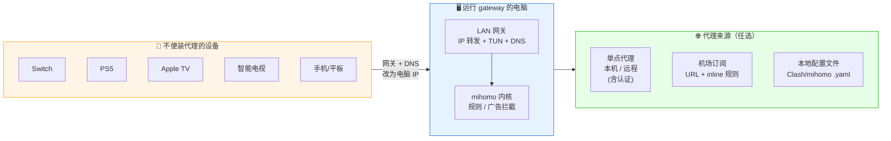
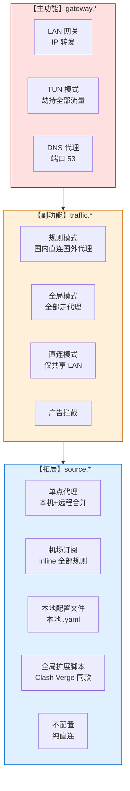

# LAN Proxy Gateway

[](https://go.dev/)
[](https://github.com/Tght1211/lan-proxy-gateway/releases)
[](LICENSE)
[]()

> **把电脑变成局域网代理网关** —— 让不方便装代理 App 的设备（Switch / PS5 / Apple TV / 智能电视 / 手机）**改个网关 + DNS** 就能科学上网。

面向**非编程玩家**：一键安装、引导式向导、全中文菜单、内嵌 `metacubexd` Web 控制台（浏览器切节点 / 改规则 / 看流量）。

---

## 🚀 一键安装

### macOS / Linux

```bash
curl -fsSL https://raw.githubusercontent.com/Tght1211/lan-proxy-gateway/main/install.sh | bash
```

### Windows（管理员 PowerShell）

```powershell
irm https://raw.githubusercontent.com/Tght1211/lan-proxy-gateway/main/install.ps1 | iex
```

> 🌏 国内访问 GitHub 慢？脚本会自动尝试镜像（`hub.gitmirror.com` / `ghproxy.com` / `moeyy.xyz` / `ddlc.top`），也可以手动指定：
> ```bash
> GITHUB_MIRROR=https://你的镜像/ bash install.sh
> ```

安装完成后，**管理员身份**运行一次：

```bash
sudo gateway install    # Mac/Linux：下载 mihomo + 3 步向导
gateway install         # Windows：在管理员 PowerShell 里跑
```

---

## 🎯 一图看懂



**核心思路**：电脑只要能科学上网（哪怕已经在跑 Clash Verge / Shadowrocket），把它变成网关就能让整屋设备一起享受，**不需要再配第二份订阅**。

---

## 🧩 三层架构



| 层级 | 能力 | 配置键 |
|---|---|---|
| **主功能** | LAN 网关（IP 转发 + TUN + DNS） | `gateway.*` |
| **副功能** | 分流 & 规则（规则 / 全局 / 直连 + 广告拦截 + 自定义规则） | `traffic.*` |
| **拓展** | 代理 & 订阅（单点 / 订阅 / 本地文件 / 无） + 全局扩展脚本 | `source.*` |

---

## 📋 首次配置向导

网关、TUN、DNS、规则模式、广告拦截都给了推荐默认值（`curl | bash` 装完自动用），唯一需要问用户的就是**代理源**：

```
把流量转发到哪里？
  1) 单点代理        (填 主机+端口；本机 Clash Verge / 远程机场的单个节点都走这个)
  2) 机场订阅        (粘一个订阅 URL，网关自己抓节点列表)
  3) 本地配置文件    (指向一个 .yaml；格式和机场订阅一致，只是本地)
  4) 暂不配置        (全部走直连，以后再来)
```

之后向导问「要不要开机自启」（默认 Y，自动装 launchd / systemd / schtasks），配置写入 `~/.config/lan-proxy-gateway/gateway.yaml`（Windows 在 `%APPDATA%\lan-proxy-gateway\`），打印接入指引后退回 shell，mihomo 在后台跑。之后想调整任何东西，`sudo gateway` 进主菜单。

---

## 📱 让其他设备接入 · 两种方式

### 方式 1 · TUN 网关（Switch / PS5 / Apple TV / 智能电视）

这些设备只能填网关 + DNS，不能填代理。

- **网关 (Gateway)** → 电脑的局域网 IP
- **DNS 服务器** → 同一个 IP
- 子网掩码 → `255.255.255.0`
- 保存并重连 Wi-Fi，所有流量（YouTube / 游戏 / App）自动走代理。

### 方式 2 · 局域网代理（iPhone / 电脑 App / 浏览器插件）

这些地方可以手动填代理服务器。

- **代理服务器** → 电脑的局域网 IP
- **端口** → `17890`（HTTP + SOCKS5 混合）
- 类型 HTTP / SOCKS5 任选，无需用户名密码

**差异**：方式 1 劫持所有流量（哪怕 Switch 不支持代理也能走）；方式 2 只走 App 自己发到代理的流量（Switch 填了也没用）。

详细接入指引可以运行 `sudo gateway` → `1 设备接入指引` 看。

### 💡 关键背景

- 方式 1 **依赖 TUN 开启** —— 光改网关让流量"流经电脑"还不够，电脑默认只做普通路由转发，Switch / PS5 照样被墙；**TUN 才是劫持并让流量走代理的关键**。本项目 TUN 默认开启，不建议关。
- 方式 1 **依赖 DNS 代理开启**（端口 53）—— 否则 fake-ip 失效，TUN auto-route 劫持可能不全面。如果本机 53 端口被占（比如已开着 Clash Verge），可以在「分流 & 规则 → 9 高级」里关掉 gateway 的 DNS 代理，由那个占用方接管 53。
- 方式 2 **跟 TUN / DNS 无关**，直接走 mihomo 的 HTTP+SOCKS5 混合端口（默认 `17890`，避开了 Clash 的 7890 防冲突）。

---

## 🌐 Web 控制台（内嵌 metacubexd）

用订阅 / 本地文件源时，浏览器打开：

```
http://<本机 IP>:19090/ui/
```

`metacubexd` dist 已经打包进 gateway binary，启动自动释放到 mihomo workdir，开箱即用。能做的事：

- 切换代理组 / 节点、测延迟、查连接实时数据
- 改模式、改规则、改 DNS
- 看日志流

主菜单 `3 代理 & 订阅` 底部会展示本机 + 局域网的可达 URL（带 ✓ 连通性检查），点一下就能用。

## 🖥️ 常用命令

所有操作都可以在**主菜单**里完成，不用记命令。下面是无人值守场景用的 cobra 命令：

| 命令 | 作用 |
|---|---|
| `gateway` | 进入主菜单（或首次配置向导） |
| `gateway install` | 下载 mihomo + 引导式向导 + 启动 + 问开机自启 |
| `gateway start` | 非交互启动（默认后台；`--foreground` 给 launchd/systemd 用） |
| `gateway stop` | 停止 |
| `gateway status` | 一次性输出当前状态 + 接入指引 |
| `gateway service install` | 安装为开机自启（launchd / systemd / schtasks） |
| `gateway service uninstall` | 卸载系统服务 |
| `gateway service status` | 查看服务状态 |

---

## 🌍 跨平台支持

| 系统 | IP 转发 | NAT | 服务 | 状态 |
|---|---|---|---|---|
| **macOS** | `sysctl net.inet.ip.forwarding=1` | `pfctl` NAT | `launchd` plist | ✅ 主要测试平台 |
| **Linux** | `/proc/sys/net/ipv4/ip_forward` | `iptables MASQUERADE` | `systemd` unit | ✅ 编译 + 单元测试通过 |
| **Windows** | 注册表 `IPEnableRouter=1` | mihomo TUN 虚拟网卡 | `schtasks` 计划任务 | ✅ 编译 + 单元测试通过 |

> Linux / Windows 建议先在小规模局域网验证再推广，遇到问题请开 issue 反馈呐 🐱

---

## ⚙️ 配置文件

完整示例见 [`gateway.example.yaml`](gateway.example.yaml)。最小示例：

```yaml
version: 2

gateway:
  enabled: true
  tun: { enabled: true, bypass_local: false }
  dns: { enabled: true, port: 53 }

traffic:
  mode: rule            # rule | global | direct
  adblock: true
  rulesets:
    china_direct: true
    apple: true
    nintendo: true
    global: true
    lan_direct: true

source:
  type: external        # external | subscription | file | remote | none（external/remote UI 统一呈现为「单点代理」）
  external:
    server: 127.0.0.1
    port: 7890          # 本机 Clash Verge 之类的上游端口
    kind: http          # http | socks5

runtime:
  ports: { mixed: 17890, redir: 17892, api: 19090 }   # 避开 Clash 默认 7890/7892/9090
```

v1 配置会在首次加载时自动升级到 v2 并打印迁移报告。

---

## 🛠️ 手动编译

```bash
git clone https://github.com/Tght1211/lan-proxy-gateway
cd lan-proxy-gateway

make build           # 编译当前平台到 ./gateway
make install         # 装到 /usr/local/bin/gateway（Mac/Linux，需 sudo）
make test            # 跑全部单元测试
make test-core       # 仅跑核心包测试（更快）
make build-all       # 交叉编译 darwin / linux / windows
```

### 目录结构（v3.1）

```
cmd/              cobra 入口（5 个命令）
internal/
  app/            统一门面：console + cobra 都调这里；含 supervisor（代理源自愈）
  gateway/        【主】LAN 网关 + 设备接入指引
  traffic/        【副】分流 & 规则 + 内置规则集 + 自定义规则合并
  source/         【拓展】代理源 inline（external/subscription/file/remote/none）+ 连通性测试
  engine/         mihomo 进程 + 渲染 + REST API（含 GroupDelay / SetMode）
  script/         goja 脚本执行器
    presets/      内嵌脚本预设（链式代理 · 住宅 IP 落地）
  config/         v3 schema（向下兼容 v1/v2）
  platform/       跨平台（darwin/linux/windows）
  console/        菜单式交互 + 日志易读视图
  mihomo/         下载 mihomo 内核
embed/
  template.yaml   mihomo config 模板
  webui/          内嵌 metacubexd dist（2.2 MB）
legacy/v1/        v1 源码留档（不参与编译）
```

---

## 🤝 贡献

欢迎 issue / PR！特别是以下方向：

- Linux / Windows 平台的实战反馈
- 新的 ruleset 内置规则
- 翻译 / 英文文档

---

## 📜 License

[MIT](LICENSE) © 2025 [Tght1211](https://github.com/Tght1211)

基于 [mihomo](https://github.com/MetaCubeX/mihomo)（Clash.Meta）内核。

---

## ⭐ Star History

[](https://star-history.com/#Tght1211/lan-proxy-gateway&Date)

如果觉得有用，点个 Star ⭐ 支持一下吧~
