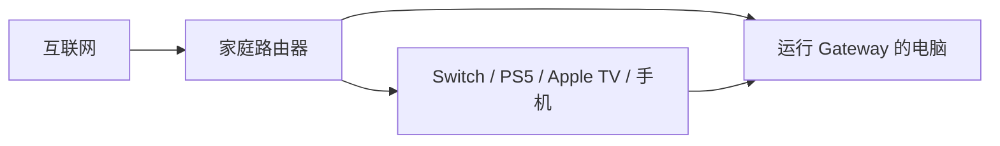

# LAN Proxy Gateway

[English](README_EN.md)

> 一个完全开源、面向教育学习的局域网透明代理网关。  
> 目标很直接: 用更低的门槛，把电脑变成一台稳定、清晰、可控的家庭代理网关。

LAN Proxy Gateway 基于 `mihomo`，把你的电脑变成一台可以给全屋设备共享的透明代理网关:

- 局域网设备只改网关和 DNS，就能通过这台电脑科学上网
- 支持 `Switch / PS5 / Apple TV / 智能电视 / 手机 / 平板`
- 支持 `订阅链接` 和 `本地 Clash / mihomo 配置文件`
- 支持 `chains` 链式代理，让 Claude / ChatGPT / Codex / Cursor 更适合走住宅出口
- 提供交互式配置中心、运行中 TUI 控制台、策略组切换、健康检查、自动升级

---

## 为什么这个项目有价值？

很多用户遇到的真实问题不是“不会配规则”，而是更前面的三步就被挡住了:

1. 设备不能装代理 App，或者装了也不好用
2. 路由器不会刷机，不想买软路由
3. 机场、规则、TUN、局域网共享、住宅代理这些概念又杂又吓人

这个项目的核心就是把这件事拆成两个所有人都能理解的能力:

1. `局域网共享`
   把电脑变成透明代理网关，局域网其他设备直接复用它的网络能力
2. `链式代理`
   在机场节点之后再接住宅代理，让 AI 服务看到更干净的住宅出口

这也是后续所有功能的边界。再加功能，也不能把这两条主线做丢。

---

## 它和 Clash Verge 的“允许局域网连接”有什么不同？

| 对比项 | Clash Verge 局域网代理 | LAN Proxy Gateway |
|---|---|---|
| 代理层级 | 应用层代理 | 网络层透明代理 |
| 设备配置方式 | 填代理服务器地址 | 改网关和 DNS |
| Switch / Apple TV / PS5 体验 | 部分场景受限 | 更适合整机透明接管 |
| App 是否感知代理 | 往往能感知 | 更接近真实网关 |
| 使用门槛 | 需要理解代理端口 | 更贴近“把电脑当网关” |

如果你想要的是“让家里别的设备一起能用”，这个项目更接近软路由体验。

---

## 核心亮点

### 1. 安装和配置更直接

- `gateway install` 安装向导
- `gateway config` 交互式配置中心
- `gateway start` 启动后直接进入运行中控制台
- `gateway status` 清楚展示入口节点、普通出口、住宅出口

### 2. 局域网透明共享



局域网设备只需要把:

- `网关 (Gateway)` 改成运行本项目的电脑 IP
- `DNS` 改成同一个电脑 IP

即可共享网络能力。

### 3. 链式代理适合 AI 账号场景

`chains` 模式可以把链路变成:

```text
你的设备 -> 机场节点 -> 住宅代理 -> Claude / ChatGPT / Codex / Cursor
```

这样更适合:

- Claude / ChatGPT 注册和使用
- Codex / Cursor 等 AI 编程工具的稳定出口
- 需要“日常流量走机场，AI 流量走住宅”的场景

### 4. 运行中 TUI 控制台

`gateway start` 成功后不会直接冷冰冰退出，而是进入运行中控制台:

- 支持 `/status` `/config` `/chains` `/groups` `/logs` 等 slash 命令
- 支持 `Ctrl+P` 打开策略组和节点选择器
- 支持在同一个屏幕里查看状态、日志、配置入口和策略切换

### 5. 面向 AI 客户端的 skill

仓库内置了项目 skill:

```bash
gateway skill
gateway skill path
```

AI 客户端安装后，可以按“场景”而不是按“背命令”来驱动这个系统，例如:

- 开通局域网共享
- 配置 chains 链式代理
- 切换策略组节点
- 打开本机绕过代理
- 排查 TUN / 日志 / API 健康状态

---

## 3 分钟快速开始

### 第 1 步: 安装

中国大陆用户优先用 CDN 入口；脚本本身会在下载 release 资产时继续自动尝试 GitHub 镜像。

#### macOS / Linux

推荐:

```bash
curl -fsSL https://cdn.jsdelivr.net/gh/Tght1211/lan-proxy-gateway@main/install.sh | bash
```

备用:

```bash
curl -fsSL https://raw.githubusercontent.com/Tght1211/lan-proxy-gateway/main/install.sh | bash
```

#### Windows PowerShell

推荐:

```powershell
irm https://cdn.jsdelivr.net/gh/Tght1211/lan-proxy-gateway@main/install.ps1 | iex
```

备用:

```powershell
irm https://raw.githubusercontent.com/Tght1211/lan-proxy-gateway/main/install.ps1 | iex
```

如果你所在网络直连 GitHub 很不稳定，也可以手动指定镜像:

```bash
GITHUB_MIRROR=https://hub.gitmirror.com/ bash install.sh
```

### 第 2 步: 初始化

```bash
gateway install
```

向导会帮你完成:

1. 下载 `mihomo`
2. 录入订阅链接或本地配置文件
3. 生成 `gateway.yaml`

### 第 3 步: 启动

```bash
sudo gateway start
```

启动成功后你会看到:

- 当前读取的 `gateway.yaml` 路径
- 局域网共享入口 IP
- 当前运行模式
- 出口摘要
- 运行中 TUI 控制台

### 第 4 步: 让其他设备接入

把其他设备的:

- `网关 (Gateway)` 改成你的电脑局域网 IP
- `DNS` 改成同一个 IP

详细设备说明:

- [iPhone / Android](docs/phone-setup.md)
- [Nintendo Switch](docs/switch-setup.md)
- [PS5](docs/ps5-setup.md)
- [Apple TV](docs/appletv-setup.md)
- [智能电视](docs/tv-setup.md)

---

## 安装后最值得尝试的 5 个功能

### 1. 打开配置中心

```bash
gateway config
```

现在已经支持:

- 代理来源
- 局域网共享 / TUN / 端口
- 规则开关与自定义规则
- 扩展模式 `chains / script / off`
- 本机绕过代理开关

### 2. 配置 chains 链式代理

```bash
gateway chains
sudo gateway restart
```

### 3. 查看入口节点、普通出口、住宅出口

```bash
gateway status
```

### 4. 普通权限自动提权控制

如果你不想每次都手动 `sudo`:

```bash
gateway permission print
sudo gateway permission install
```

配置好后，CLI 会自动尝试 `sudo -n` 提权。

### 5. 本机绕过代理

如果你希望:

- 这台网关电脑继续直连或保持自己原有网络
- 只有局域网其他设备使用科学上网能力

可以在配置中心开启:

```yaml
runtime:
  tun:
    enabled: true
    bypass_local: true
```

---

## 配置结构

为了保证项目继续扩展时不把核心做散，配置结构现在固定围绕 4 个区块组织:

```yaml
proxy:
  source: url
  subscription_url: "https://example.com"
  config_file: /path/to/config.yaml
  subscription_name: subscription

runtime:
  ports:
    mixed: 7890
    redir: 7892
    api: 9090
    dns: 53
  api_secret: ""
  tun:
    enabled: true
    bypass_local: false

rules:
  lan_direct: true
  china_direct: true
  apple_rules: true
  nintendo_proxy: true
  global_proxy: true
  ads_reject: true

extension:
  mode: chains
  script_path: ./script-demo.js
  residential_chain:
    mode: rule
    proxy_server: "1.2.3.4"
    proxy_port: 443
    proxy_type: socks5
    airport_group: Auto
```

其中:

- `proxy` 只负责代理来源
- `runtime` 只负责运行和局域网共享
- `rules` 只负责规则系统
- `extension` 只负责链式代理或脚本扩展

旧版顶层配置仍然兼容读取，不会因为结构升级把老用户配置读坏。

---

## 规则系统

默认规则重点围绕“让中国用户更顺手”来设计:

- 局域网与保留地址直连
- 微信、QQ、腾讯生态、小红书、抖音、头条、王者荣耀等国内常见服务直连
- Apple 常用服务分流
- Nintendo 相关服务走代理
- 常见广告与跟踪域名拦截
- 常见国外网站和 AI 服务走代理

你也可以继续追加:

- `rules.extra_direct_rules`
- `rules.extra_proxy_rules`
- `rules.extra_reject_rules`

---

## 自动更新体验

这个项目现在已经有:

- `gateway update` 主动升级
- 首页 / 启动页 / TUI 控制台里的新版提醒
- 下载 release 时自动尝试镜像

目标体验接近 `on-my-zsh` 那种“打开就知道有新版，但不烦人”。

---

## 常用命令

| 命令 | 说明 |
|---|---|
| `gateway install` | 安装向导 |
| `gateway config` | 配置中心 |
| `sudo gateway start` | 启动网关并进入运行中控制台 |
| `gateway status` | 查看运行状态和出口网络 |
| `gateway chains` | 链式代理向导 |
| `gateway switch` | 切换代理来源和扩展模式 |
| `gateway skill` | 查看 AI skill 信息 |
| `gateway permission install` | 安装免密控制权限 |
| `sudo gateway update` | 升级到最新版 |

完整命令见 [docs/commands.md](docs/commands.md)。

---

## 文档导航

- [命令总览](docs/commands.md)
- [进阶配置](docs/advanced.md)
- [常见问题](docs/faq.md)
- [Switch 配置](docs/switch-setup.md)
- [PS5 配置](docs/ps5-setup.md)
- [Apple TV 配置](docs/appletv-setup.md)
- [手机配置](docs/phone-setup.md)

---

## Release 下载

Releases 会同时提供:

- 各平台原始二进制
- 压缩包
- `SHA256SUMS`
- 升级说明

下载入口:

- [GitHub Releases](https://github.com/Tght1211/lan-proxy-gateway/releases)

直接下载:

| 系统 | 下载 |
|---|---|
| macOS Apple Silicon | [gateway-darwin-arm64](https://github.com/Tght1211/lan-proxy-gateway/releases/latest/download/gateway-darwin-arm64) / [gateway-darwin-arm64.tar.gz](https://github.com/Tght1211/lan-proxy-gateway/releases/latest/download/gateway-darwin-arm64.tar.gz) |
| macOS Intel | [gateway-darwin-amd64](https://github.com/Tght1211/lan-proxy-gateway/releases/latest/download/gateway-darwin-amd64) / [gateway-darwin-amd64.tar.gz](https://github.com/Tght1211/lan-proxy-gateway/releases/latest/download/gateway-darwin-amd64.tar.gz) |
| Linux x86_64 | [gateway-linux-amd64](https://github.com/Tght1211/lan-proxy-gateway/releases/latest/download/gateway-linux-amd64) / [gateway-linux-amd64.tar.gz](https://github.com/Tght1211/lan-proxy-gateway/releases/latest/download/gateway-linux-amd64.tar.gz) |
| Linux ARM64 | [gateway-linux-arm64](https://github.com/Tght1211/lan-proxy-gateway/releases/latest/download/gateway-linux-arm64) / [gateway-linux-arm64.tar.gz](https://github.com/Tght1211/lan-proxy-gateway/releases/latest/download/gateway-linux-arm64.tar.gz) |
| Windows x86_64 | [gateway-windows-amd64.exe](https://github.com/Tght1211/lan-proxy-gateway/releases/latest/download/gateway-windows-amd64.exe) / [gateway-windows-amd64.zip](https://github.com/Tght1211/lan-proxy-gateway/releases/latest/download/gateway-windows-amd64.zip) |

---

## 开源说明

本项目完全开源，主要用于:

- 网络与代理技术学习
- 家庭局域网网关实践
- TUN / 透明代理 / 分流规则研究
- AI 客户端与 CLI / TUI 交互设计探索

请在你所在地区法律法规允许的前提下使用。

---

## License

[MIT](LICENSE)
