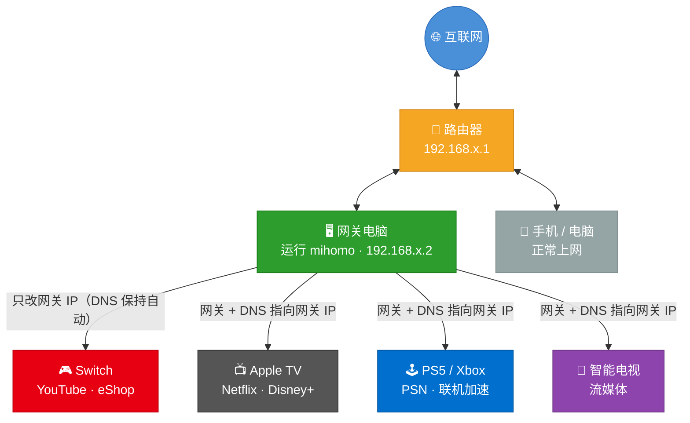

# LAN Proxy Gateway

**把你的电脑变成全屋科学上网网关，Switch / PS5 / Apple TV / 智能电视 改个网关设置就能用。**

不刷路由器固件，不买软路由，一条命令搞定。支持 **macOS / Linux / Windows**。

---

## 这是什么，我能用来干嘛？

家里总有些设备**没法或不方便装代理软件**：Switch、PS5 压根装不了，智能电视生态封闭，Apple TV 虽然能装但又麻烦……

用这个工具，统一在电脑上处理，**所有设备改个网关设置就能用，一个都不用装代理 App**。



---

## 和 Clash Verge "局域网代理" 有什么区别？

很多人已经在用 Clash Verge，它有一个"允许局域网连接"选项。这两种方案看起来相似，但**原理完全不同**，解决的也是不同的问题：

| | Clash Verge 局域网代理 | LAN Proxy Gateway（本工具） |
|---|---|---|
| **原理** | 应用层代理（HTTP/SOCKS5 端口 7890） | 网络层透明代理（TUN 虚拟网卡） |
| **设备配置方式** | 在设备"代理服务器"里填电脑 IP:7890 | 改设备的"网关"和 IP 指向电脑 |
| **Switch 看 YouTube** | ❌ **不行**，即使配了代理也无法解锁 YouTube | ✅ 能，改网关即可解锁 |
| **PS5 / Apple TV 流媒体** | ⚠️ 部分设备能配代理，但解锁效果不稳定 | ✅ 能，走网关层透明代理更彻底 |
| **iPhone / Android** | ✅ 可以，手动填代理服务器 | ✅ 可以，无感更彻底 |
| **App 能感知到代理** | 是，App 可检测到，部分服务会拒绝 | 否，完全透明，App 感知不到 |
| **国内/国外分流** | 取决于 Clash 规则 | 内置智能分流，国内直连 |

**核心区别：** Clash Verge 局域网代理走的是**应用层**——设备通过代理服务器上网，但这种方式在 Switch 上无法解锁 YouTube 等流媒体（实测）。本工具走的是**网络层**——设备把网关改成你的电脑，所有流量在路由层就被透明接管，和在路由器上刷固件的效果相同，能真正解锁 Switch 上的 YouTube 和 eShop。

> **已在用 Clash Verge 的注意：** 两者都用 TUN 模式时会产生冲突（都要创建虚拟网卡）。使用本工具前，请关闭 Clash Verge 的 TUN 模式，或直接退出 Clash Verge。

---

## 开始之前，你需要准备

| 需要什么 | 说明 |
|---------|------|
| 一台电脑 | Mac / Linux / Windows 均可，电脑要保持开机 |
| 代理订阅链接 | 机场提供的那串 URL（通常叫"Clash 订阅"或"通用订阅"） |
| 所有设备连同一个 Wi-Fi | 你的电脑和要科学上网的设备必须在同一个路由器下 |

> **没有订阅链接？** 本工具只是网关，不提供代理节点。你需要先购买一个支持 Clash/mihomo 格式的代理服务（俗称"机场"），它会提供给你一个订阅链接。

---

## 第一步：安装工具

### 推荐方式：一键安装脚本

> **脚本下载成功后，后续的二进制文件会自动尝试多个镜像，无需手动干预。**

打开终端（Mac 上搜索"终端"或"Terminal"，Windows 打开"PowerShell"），运行对应命令：

**macOS / Linux：**

```bash
curl -fsSL https://raw.githubusercontent.com/Tght1211/lan-proxy-gateway/main/install.sh | bash
```

**Windows（PowerShell，右键"以管理员身份运行"）：**

```powershell
irm https://raw.githubusercontent.com/Tght1211/lan-proxy-gateway/main/install.ps1 | iex
```

脚本会自动完成所有安装，**不需要提前安装任何依赖**。

---

### 备用方式：手动下载（脚本全部失败时）

去 Releases 页面直接下载二进制文件（任选一个能打开的链接）：

- GitHub 直连：https://github.com/Tght1211/lan-proxy-gateway/releases

根据你的系统下载对应文件：

| 你的电脑 | 下载哪个文件 |
|---------|------------|
| Mac（M1 / M2 / M3 / M4 芯片） | `gateway-darwin-arm64` |
| Mac（Intel 芯片） | `gateway-darwin-amd64` |
| Linux（x86_64） | `gateway-linux-amd64` |
| Linux（ARM，如树莓派） | `gateway-linux-arm64` |
| Windows | `gateway-windows-amd64.exe` |

> **不确定 Mac 是哪种芯片？** 点左上角苹果图标 → "关于本机"，看到 M1/M2/M3/M4 选 arm64，看到 Intel 选 amd64。

下载后，macOS / Linux 需要额外执行：

```bash
chmod +x gateway-*                         # 给文件添加执行权限
sudo mv gateway-* /usr/local/bin/gateway   # 移到系统路径，方便全局使用
```

---

## 第二步：初始化配置

安装完成后，运行初始化向导：

```bash
gateway install
```

向导会依次引导你：

1. **自动下载 mihomo 内核**（代理核心程序，会自动选择最快的下载源）
2. **选择代理来源**：输入你的订阅链接，或指定本地配置文件路径
3. **生成配置文件**：自动完成，无需手动编辑

整个过程约 1～3 分钟，跟着提示走就行。

---

## 第三步：启动网关

```bash
sudo gateway start
```

> macOS / Linux 需要 `sudo`，因为 TUN 模式要创建虚拟网卡，这是系统级操作。Windows 请在管理员模式下运行。

**启动成功后，终端会显示你电脑的 IP 地址**，类似这样：

```
✓ 网关已启动
  本机 IP：192.168.1.2
  将其他设备的「网关」和「DNS」都改成这个 IP 即可
```

**记下这个 IP**（例如 `192.168.1.2`），后面配置其他设备会用到。

> **不知道自己电脑 IP？** 随时可以运行 `gateway status` 查看。

---

## 第四步：设置你的设备

**将设备的「网关」和「DNS」改成你电脑的 IP**，详细步骤见对应指南：

| 设备 | 配置指南 |
|------|---------|
| iPhone / iPad | [docs/phone-setup.md](docs/phone-setup.md) |
| Android 手机 / 平板 | [docs/phone-setup.md](docs/phone-setup.md) |
| Nintendo Switch | [docs/switch-setup.md](docs/switch-setup.md)（**只改网关，不改 DNS**） |
| PS5 | [docs/ps5-setup.md](docs/ps5-setup.md) |
| Apple TV | [docs/appletv-setup.md](docs/appletv-setup.md) |
| 智能电视（安卓） | [docs/tv-setup.md](docs/tv-setup.md) |

---

## 命令速查

| 命令 | 说明 |
|------|------|
| `gateway install` | 初始化向导（下载内核、配置订阅） |
| `sudo gateway start` | 启动网关 |
| `sudo gateway stop` | 停止网关 |
| `gateway status` | 查看运行状态和本机 IP |
| `sudo gateway update` | 升级到最新版本 |
| `gateway tun on/off` | 开关 TUN 透明代理模式（Switch/PS5/电视必须开） |

> 完整命令列表（切换订阅、开机自启、全局参数等）见 [docs/commands.md](docs/commands.md)

---

## 管理面板（Web UI）

网关运行后，浏览器打开以下地址即可看到图形化管理界面：

```
http://你电脑的IP:9090/ui
```

在这里可以查看节点延迟、手动切换节点、查看实时流量统计。

---

## 常见问题

- 配好后国外还是慢 → 管理面板换延迟低的节点
- 设备完全断网 → 检查网关 IP 填写是否正确，`gateway status` 确认网关在运行
- 关掉网关后设备断网 → 把设备网络改回 DHCP 自动获取，或忘记 Wi-Fi 重连

> 更多问题见 [docs/faq.md](docs/faq.md)

---

## 进阶

- **开机自启 + 崩溃自愈**：`sudo gateway service install`
- **自定义分流规则**：通过扩展脚本插入自定义规则，兼容 Clash Verge Rev 格式

> 详细配置见 [docs/advanced.md](docs/advanced.md)

---

## License

[MIT](LICENSE)
