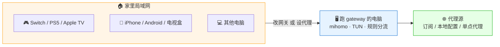

# LAN Proxy Gateway

[](https://github.com/Tght1211/lan-proxy-gateway/releases)
[](https://go.dev/)
[]()
[](LICENSE)

> **把一台电脑变成整屋的代理网关** —— 一台机器配好代理，整屋设备（手机 / Switch / PS5 / Apple TV / 智能电视）一起用，**不用每台都装代理 App**。

中文菜单 · 一键安装 · 内嵌 Gateway Web 控制台。基于 [mihomo](https://github.com/MetaCubeX/mihomo)（Clash.Meta）。English: [README_EN.md](README_EN.md)



---

## ⚡ 3 分钟上手

### 1. 安装

```bash
# macOS / Linux
curl -fsSL https://raw.githubusercontent.com/Tght1211/lan-proxy-gateway/main/install.sh | bash

# Windows（管理员 PowerShell）
irm https://raw.githubusercontent.com/Tght1211/lan-proxy-gateway/main/install.ps1 | iex
```

装完自动进入配置向导（问代理源 → 启动 → 问开机自启）。国内访问 GitHub 慢可设 `GITHUB_MIRROR=https://你的镜像/`，或在已跑着 Clash 的机器上 `export HTTP_PROXY=http://127.0.0.1:7897` 再跑。

### 2. 启动

```bash
sudo gateway start     # macOS / Linux
gateway start          # Windows（管理员终端，无需 sudo）
```

控制台会显示**本机 LAN IP**和**代理端口**，下一步要填的就是这两个。

### 3. 接入设备

| 你的设备 | 选哪种 | 填什么 |
|---|---|---|
| 🎮 **Switch / PS5 / Apple TV / 智能电视** | 改网关 *(仅 macOS / Linux)* | 网关 + DNS = gateway 电脑 IP |
| 📱 **iPhone / Android / 浏览器** | 设代理 | HTTP 代理：`gateway IP : 17890` |
| 💻 **本机也走规则** | TUN | 菜单开 TUN 自动生效；macOS 按 `L` 一键切 DNS |

> ⚠️ **Windows 家用版限制**：没有 RRAS / ICS 受限，**改网关方式走不通**。所有设备只能走「设代理」方式；Switch / PS5 等不能设代理的设备**在 Windows 上无解**，请改用 Linux / macOS 主机或软路由。

详细步骤（含 Switch/PS5/电视截图）：[docs/device-setup.md](docs/device-setup.md)

---

## ✨ 核心能力

| 能力 | 说明 |
|---|---|
| 🌐 **LAN 透明网关** | 设备改网关 + DNS 就接管（macOS/Linux）；不能改网关的设备走 HTTP 代理（全平台） |
| 🔗 **三种代理源** | 机场订阅 URL / 本地 `.yaml` / 本机已在跑的 Clash 端口（二次代理）；本机单点上游仍支持 `17890` 共享和改网关透明代理 |
| 🏠 **链式代理预设** | 一键「机场起飞 + 住宅 IP 落地」，AI 网站看到的是家庭宽带 ASN |
| 🌐 **内嵌 Web 控制台** | 浏览器开 `http://gatewayIP:19091/`，在首页切代理源 / 切分组节点 / 测速 / 看接入设备 / 控制 TUN 与代理服务 |
| 🔐 **代理服务认证** | 局域网 HTTP/SOCKS5 `mixed-port` 可独立开关，并可选设置用户名 / 密码；TUN 透明代理可同时开启 |
| ⚡ **代理源 supervisor** | 订阅/文件源异常时自动切直连保命；本机单点代理只监控端口，避免误切 |
| 🎯 **规则系统** | 内置 LAN 直连 / 中国直连 / Apple / Nintendo / 广告拦截，菜单可改 |
| 📊 **节点测速** | 切节点页面自动并发测延迟，按速度升序 |
| 🗒️ **中文日志视图** | mihomo 英文日志翻译成中文（`🟡 TCP 直连 xxx → 超时`） |

---

## 🎯 适合谁

- 🎮 **想给 Switch / PS5 / Apple TV / 智能电视用代理**：这些设备没代理 App 可装，只能改网关。典型玩法：Switch 联机加速（Splatoon 3 / 马车 / 怪猎）、eShop / PSN 商店下载加速、Steam / Epic 下载加速
- 📱 **iPhone / iPad 不想装 VPN App**：家里电脑做一台共享代理，手机 Wi-Fi 改下代理就能用
- 👨‍👩‍👧 **全家多台设备共用一份订阅**：订阅只放在 gateway 这台，其他设备零配置接入
- 🔁 **给 Clash Verge / V2RayN / Mihomo Party 补功能**：复用现有客户端的节点池，给它套上「链式代理 + 整屋 LAN 共享 + TUN 网关」三件套，原客户端不用换不用动

完整玩法 + 流量路径图：[docs/scenarios.md](docs/scenarios.md)

---

## 🆚 跟 Clash Verge 的「局域网共享」有啥区别

| 项目 | Clash Verge LAN 共享 | LAN Proxy Gateway |
|---|---|---|
| 代理层级 | 应用层 HTTP 代理 | 网络层透明代理 + TUN |
| 设备配置 | 每台填代理 IP:Port | 改网关 + DNS 即可（无代理设置的设备唯一解） |
| Switch / PS5 / 电视 | 多数不支持代理设置 → 用不了 | ✅ 原生支持 |
| App 是否能察觉 | 容易被探测 | 接近真路由器 |
| 链式代理 | ❌ | ✅ 一键预设 |

---

## 📚 文档导航

**接入设备**

- [device-setup.md](docs/device-setup.md) — 三种接入方式对比 + 详细步骤
- [phone-setup.md](docs/phone-setup.md) · [switch-setup.md](docs/switch-setup.md) · [ps5-setup.md](docs/ps5-setup.md) · [appletv-setup.md](docs/appletv-setup.md) · [tv-setup.md](docs/tv-setup.md)

**玩法 & 排错**

- [scenarios.md](docs/scenarios.md) — 典型场景（含 AI 住宅 IP 链式代理招牌教程）
- [faq.md](docs/faq.md) — 常见问题

**命令 & 配置**

- [commands.md](docs/commands.md) — 完整命令行 + 主菜单一览
- [advanced.md](docs/advanced.md) — 配置文件 schema / 进阶调优

**项目结构**

- [architecture.md](docs/architecture.md) — 三层架构 / 跨平台实现 / 目录结构
- [release-process.md](docs/release-process.md) · [versioning.md](docs/versioning.md)

---

## 🔄 升级 / 回退

```bash
sudo gateway update            # 升级到最新
sudo gateway update latest     # 同上，显式指定 latest
sudo gateway update v3.4.3     # 升级或回退到指定版本
```

第一次升到 v3.4.4 之前的版本，或没有 `gateway update` 子命令时，跑安装脚本即可（覆盖式安装，会保留 `gateway.yaml`）：

```bash
curl -fsSL https://raw.githubusercontent.com/Tght1211/lan-proxy-gateway/main/install.sh | sudo bash
```

---

## 📜 License

[MIT](LICENSE) © 2025-2026 [Tght1211](https://github.com/Tght1211)
基于 [mihomo](https://github.com/MetaCubeX/mihomo) 内核 + [metacubexd](https://github.com/MetaCubeX/metacubexd) 控制台。

## ⭐ Star History

[](https://star-history.com/#Tght1211/lan-proxy-gateway&Date)

觉得有用就点个 Star ⭐ 支持一下吧～
