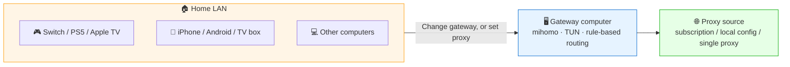

# LAN Proxy Gateway

[](https://github.com/Tght1211/lan-proxy-gateway/releases)
[](https://go.dev/)
[]()
[](LICENSE)

> **Turn one computer into a LAN-wide proxy gateway.** Configure proxies once on the gateway machine, and every device in your house (phone / Switch / PS5 / Apple TV / smart TV) uses them — **no proxy app needed on each device**.

Menu-driven CLI · one-line install · built-in Gateway web dashboard. Built on [mihomo](https://github.com/MetaCubeX/mihomo) (Clash.Meta). 中文: [README.md](README.md)



---

## ⚡ 3-Minute Quick Start

### 1. Install

```bash
# macOS / Linux
curl -fsSL https://raw.githubusercontent.com/Tght1211/lan-proxy-gateway/main/install.sh | bash

# Windows (Administrator PowerShell)
irm https://raw.githubusercontent.com/Tght1211/lan-proxy-gateway/main/install.ps1 | iex
```

The script walks you through a setup wizard (proxy source → start → optional auto-start). If GitHub is slow from your network, set `GITHUB_MIRROR=https://your-mirror/`, or if you already have Clash running locally, `export HTTP_PROXY=http://127.0.0.1:7897` first.

### 2. Start

```bash
sudo gateway start     # macOS / Linux
gateway start          # Windows (Administrator terminal, no sudo)
```

The console shows the **LAN IP** and **proxy port** — that's what your other devices will point at.

### 3. Connect devices

| Your device | Method | What to fill in |
|---|---|---|
| 🎮 **Switch / PS5 / Apple TV / smart TV** | Change gateway *(macOS / Linux only)* | Gateway + DNS = the gateway computer's LAN IP |
| 📱 **iPhone / Android / browser** | Set HTTP proxy | HTTP proxy: `gateway IP : 17890` |
| 💻 **The gateway machine itself** | TUN | Enable TUN in the menu; on macOS press `L` to switch local DNS |

> ⚠️ **Windows Home limitation**: no RRAS, ICS is locked to `192.168.137/24`, so **"change gateway" mode does not work**. All devices must use the "set HTTP proxy" path. Switch / PS5 / Apple TV / smart TVs that can only take a gateway (not a proxy) **cannot be served from a Windows host** — use Linux / macOS or a soft router instead.

Detailed walkthroughs (with screenshots): [docs/en/](docs/en/) — phone / switch / ps5 / appletv / tv

---

## ✨ What it does

| Capability | What it gives you |
|---|---|
| 🌐 **LAN transparent gateway** | Devices join by changing gateway + DNS (macOS/Linux); devices that can't change gateway use HTTP proxy (all platforms) |
| 🔗 **Three proxy sources** | Clash/mihomo subscription URL · local `.yaml` · an already-running Clash port on the same machine (chaining); local single-proxy mode still supports both `17890` sharing and transparent gateway mode |
| 🏠 **Chains preset** | One-click "airport entry → residential exit" — AI sites see a residential ASN |
| 🌐 **Built-in web dashboard** | Open `http://gatewayIP:19091/` to switch proxy sources, policy groups, nodes, run latency tests, inspect connected devices, and control TUN / proxy service independently |
| 🔐 **Proxy service auth** | The LAN HTTP/SOCKS5 `mixed-port` can be enabled/disabled independently and optionally protected with username/password while TUN stays available |
| ⚡ **Source supervisor** | Auto-fallbacks subscription/file sources to direct when broken; local single-proxy mode only monitors the port to avoid false switches |
| 🎯 **Rule system** | Built-in LAN-direct, China-direct, Apple, Nintendo, ad-blocking, AI-service rules — fully editable |
| 📊 **Node latency probe** | Switch-node page concurrently measures latency and sorts by speed |
| 🗒️ **Readable log view** | mihomo's English logs rendered in a folded, deduplicated view |

---

## 🎯 Who it's for

- 🎮 **You want proxies on Switch / PS5 / Apple TV / smart TV** — these devices have no proxy app to install, only a gateway field. Common uses: Switch online play, eShop / PSN downloads, Steam / Epic / Xbox downloads
- 📱 **You don't want a VPN app on your phone** — set the Wi-Fi proxy to your home gateway and you're done
- 👨‍👩‍👧 **One household subscription, all devices** — keep the subscription on one machine, every other device joins with zero config
- 🔁 **Augment Clash Verge / V2RayN / Mihomo Party** — reuse the running client's node pool; bolt on chains, LAN sharing, and TUN gateway without replacing it

Detailed scenarios + traffic-path diagrams: [docs/scenarios.md](docs/scenarios.md) (Chinese)

---

## 🆚 vs. Clash Verge's "LAN Access"

| Item | Clash Verge LAN Access | LAN Proxy Gateway |
|---|---|---|
| Proxy layer | Application-level HTTP proxy | Network-level transparent proxy + TUN |
| Device setup | Fill proxy IP:Port on every device | Change gateway + DNS (only option for devices that don't take a proxy) |
| Switch / PS5 / TV | Mostly no proxy field → unusable | ✅ Works natively |
| App proxy awareness | Often detectable | Closer to a real router |
| Chains | ❌ | ✅ One-click preset |

---

## 📚 Documentation

**Device setup**

- [phone-setup](docs/en/phone-setup.md) · [switch-setup](docs/en/switch-setup.md) · [ps5-setup](docs/en/ps5-setup.md) · [appletv-setup](docs/en/appletv-setup.md) · [tv-setup](docs/en/tv-setup.md)

**Commands & config**

- [commands.md](docs/en/commands.md) — full CLI reference and menu map
- [advanced.md](docs/en/advanced.md) — config schema & tuning
- [faq.md](docs/en/faq.md)
- [versioning.md](docs/en/versioning.md)

---

## 🔄 Update / rollback

```bash
sudo gateway update            # latest release
sudo gateway update latest     # same as above
sudo gateway update v3.4.3     # specific tag (or rollback)
```

First time upgrading from a pre-v3.4.3 install (no `gateway update` subcommand yet), just re-run the install script — it overwrites in place and preserves your `gateway.yaml`:

```bash
curl -fsSL https://raw.githubusercontent.com/Tght1211/lan-proxy-gateway/main/install.sh | sudo bash
```

---

## 🛠️ Local Development

```bash
./dev.sh build        # writes .tmp/gateway-dev
./dev.sh test         # go test ./...
./dev.sh test-core    # smaller core package set
./dev.sh run -- --version
./dev.sh start        # builds locally, sudo only for the runtime step
```

The Go build cache defaults to `.cache/go-build` inside the repo to avoid global-cache permission issues.

---

## 📜 License

[MIT](LICENSE) © 2025-2026 [Tght1211](https://github.com/Tght1211)
Built on [mihomo](https://github.com/MetaCubeX/mihomo) + [metacubexd](https://github.com/MetaCubeX/metacubexd).

## ⭐ Star History

[](https://star-history.com/#Tght1211/lan-proxy-gateway&Date)
