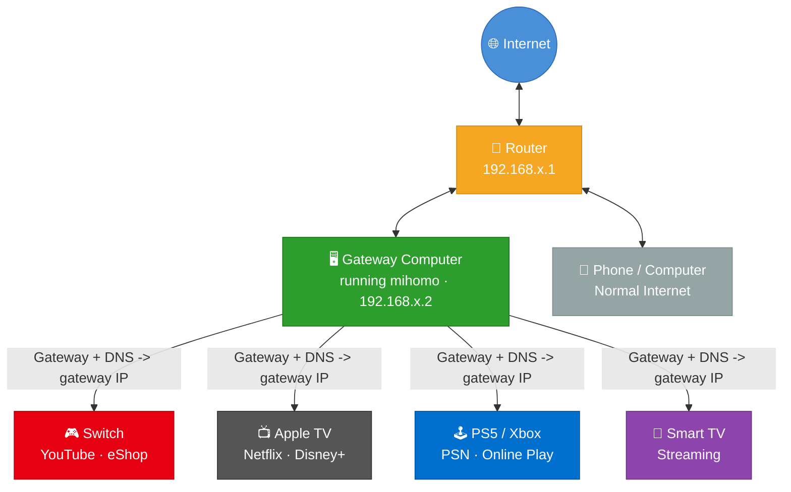
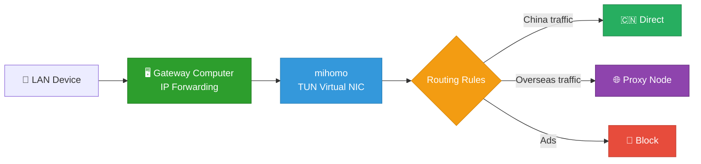

# LAN Proxy Gateway

[中文说明](README.md)

[](https://github.com/Tght1211/lan-proxy-gateway/releases)
[](https://github.com/Tght1211/lan-proxy-gateway/stargazers)
[](LICENSE)
[](https://go.dev/)

Turn your computer into a LAN-wide transparent proxy gateway.  
No router flashing, no extra soft router, just change the gateway and DNS on your `Switch / PS5 / Apple TV / smart TV / phone`.

This project is built on `mihomo` and focuses on two things:

- `LAN sharing`: devices that cannot install proxy apps can still use transparent proxying
- `Chains`: `Claude / ChatGPT / Codex / Cursor` can use a cleaner residential exit

> Fully open source. Chinese-first project, but the networking model is globally applicable.



## Core Capabilities

### 1. LAN-wide transparent sharing

- Devices join by changing only gateway and DNS
- Supports `Switch / PS5 / Apple TV / smart TV / phone / tablet`
- Supports `TUN` mode and `bypass local host`

### 2. Chains mode

```text
Your device -> airport node -> residential proxy -> Claude / ChatGPT / Codex / Cursor
```

Useful for:

- Claude / ChatGPT signup and usage
- Codex / Cursor style AI coding tools
- keeping daily traffic on airport nodes while AI traffic uses residential exit

### 3. Runtime console

After `gateway start`, the app enters a TUI console with:

- `/status` `/config` `/chains` `/groups` `/logs`
- `Ctrl+P` for proxy group and node switching
- confirmation flow, logs, and runtime summaries

### 4. Rule system

Built-in defaults include:

- LAN and reserved address direct access
- common mainland-China services direct access
- Apple / Nintendo related rules
- ad and tracking domain blocking
- proxy rules for overseas sites and AI services

## 3-Minute Quick Start

### Step 1: Install

Install `gateway` first. For users in mainland China, the CDN entry is usually easier.

#### macOS / Linux

Recommended:

```bash
curl -fsSL https://cdn.jsdelivr.net/gh/Tght1211/lan-proxy-gateway@main/install.sh | bash
```

Fallback:

```bash
curl -fsSL https://raw.githubusercontent.com/Tght1211/lan-proxy-gateway/main/install.sh | bash
```

#### Windows PowerShell

Recommended:

```powershell
irm https://cdn.jsdelivr.net/gh/Tght1211/lan-proxy-gateway@main/install.ps1 | iex
```

Fallback:

```powershell
irm https://raw.githubusercontent.com/Tght1211/lan-proxy-gateway/main/install.ps1 | iex
```

If GitHub is unstable from your network, you can also force a mirror:

```bash
GITHUB_MIRROR=https://hub.gitmirror.com/ bash install.sh
```

### Step 2: Initialize

```bash
gateway install
```

The setup wizard will:

1. download `mihomo`
2. ask for a subscription URL or local config file
3. generate `gateway.yaml`

If you just want the fastest path, only fill these:

- proxy source
- subscription URL or local config file
- subscription name

### Step 3: Start the gateway

```bash
sudo gateway start
```

After startup, the terminal will show:

- the config file path in use
- your LAN gateway IP
- runtime mode
- egress summary
- the runtime TUI console

The most important thing here is your LAN IP.

### Step 4: Connect another device

Change the device's:

- `Gateway` to your computer's LAN IP
- `DNS` to the same IP

If you want a quick first test, start with:

- [iPhone / Android](docs/phone-setup.md)
- [Nintendo Switch](docs/switch-setup.md)
- [PS5](docs/ps5-setup.md)
- [Apple TV](docs/appletv-setup.md)
- [Smart TV](docs/tv-setup.md)

### Step 5: Verify

```bash
gateway status
```

You will see:

- current node
- entry node
- regular exit
- residential exit, if `chains` is enabled

## Common Commands

| Command | Purpose |
|---|---|
| `gateway install` | Initial setup wizard |
| `gateway config` | Interactive config center |
| `sudo gateway start` | Start gateway and open runtime TUI |
| `gateway status` | Show runtime and egress status |
| `gateway chains` | Chains / residential proxy wizard |
| `gateway switch` | Switch proxy source and extension mode |
| `gateway skill` | Show AI skill info |
| `gateway permission install` | Install passwordless control rule |
| `sudo gateway update` | Upgrade to the latest version |

Full command reference: [docs/commands.md](docs/commands.md)

## How It Works



1. The computer enables IP forwarding and becomes the LAN gateway
2. `mihomo` captures traffic in TUN mode
3. The rule system decides direct, proxy, or block
4. In `chains` mode, AI traffic can continue to a residential exit

## Documentation

- [Command Reference](docs/commands.md)
- [Advanced Guide](docs/advanced.md)
- [FAQ](docs/faq.md)
- [Versioning Notes](docs/versioning.md)
- [Switch Setup](docs/switch-setup.md)
- [PS5 Setup](docs/ps5-setup.md)
- [Apple TV Setup](docs/appletv-setup.md)
- [Phone Setup](docs/phone-setup.md)

## How It Differs from Clash Verge LAN Access

| Item | Clash Verge LAN Access | LAN Proxy Gateway |
|---|---|---|
| Proxy layer | Application-level proxy | Network-level transparent proxy |
| Device setup | Fill proxy server address | Change gateway and DNS |
| Switch / Apple TV / PS5 | Limited in some cases | Better for full-device transparent takeover |
| App proxy awareness | Often detectable | Closer to a real gateway |
| Typical use | Per-device proxy | Whole-home shared gateway |

## Open Source

This project is mainly for:

- networking and proxy learning
- home LAN gateway practice
- TUN / transparent proxy / routing rule experiments
- AI client and CLI / TUI interaction design

Use it only where legal and appropriate.

## License

[MIT](LICENSE)
