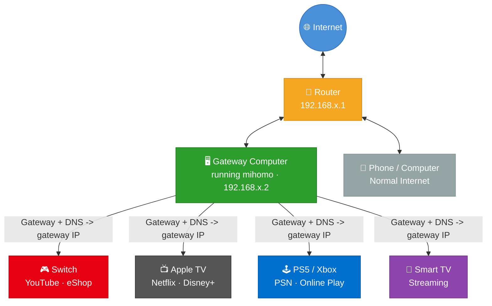
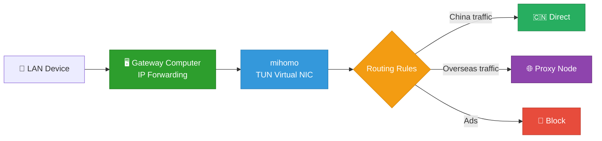

# LAN Proxy Gateway

[Chinese README](README.md)

[](https://github.com/Tght1211/lan-proxy-gateway/releases)
[](https://github.com/Tght1211/lan-proxy-gateway/stargazers)
[](LICENSE)
[](https://go.dev/)

Turn your computer into a LAN-wide transparent proxy gateway.  
No router flashing, no extra soft router, just change the gateway and DNS on your `Switch / PS5 / Apple TV / smart TV / phone`.

This project is built on `mihomo` and focuses on two things:

- `LAN sharing`: devices that cannot install proxy apps can still use transparent proxying
- `Chains`: `Claude / ChatGPT / Codex / Cursor` can use a cleaner residential exit

> Fully open source. Chinese-first project, but the networking model is globally applicable.



## Core Capabilities

### 1. LAN-wide transparent sharing

- Devices join by changing only gateway and DNS
- Supports `Switch / PS5 / Apple TV / smart TV / phone / tablet`
- Supports `TUN` mode and `bypass local host`

### 2. Chains mode

```text
Your device -> airport node -> residential proxy -> Claude / ChatGPT / Codex / Cursor
```

Useful for:

- Claude / ChatGPT signup and usage
- Codex / Cursor style AI coding tools
- keeping daily traffic on airport nodes while AI traffic uses residential exit

### 3. Runtime console

By default, `gateway start` opens a menu-driven CLI console. You land on the home menu immediately, so there is no extra "login shell first, remember commands later" step.

From the menu, you can directly:

- view runtime status and the current config summary
- switch proxy groups and nodes, with latency retest and sorting
- manage subscriptions, proxy source, and subscription names
- toggle TUN, local bypass, and recommended rules
- manage `chains / script / off` and residential-proxy settings
- open the full config center
- check device setup, logs, and update notices

Interaction style:

- startup opens the home menu right away, then you pick by number
- each workbench shows current state plus a fixed action list
- `gateway console` re-enters the same menu system later
- the old `--tui` entry has been removed; if you still pass it, the CLI tells you to use the default console

### 4. Rule system

Built-in defaults include:

- LAN and reserved address direct access
- common mainland-China services direct access
- Apple / Nintendo related rules
- ad and tracking domain blocking
- proxy rules for overseas sites and AI services

## 3-Minute Quick Start

### Step 1: Install

Install `gateway` first. For users in mainland China, the CDN entry is usually easier.

#### macOS / Linux

Recommended:

```bash
curl -fsSL https://cdn.jsdelivr.net/gh/Tght1211/lan-proxy-gateway@main/install.sh | bash
```

Fallback:

```bash
curl -fsSL https://raw.githubusercontent.com/Tght1211/lan-proxy-gateway/main/install.sh | bash
```

#### Windows PowerShell

Recommended:

```powershell
irm https://cdn.jsdelivr.net/gh/Tght1211/lan-proxy-gateway@main/install.ps1 | iex
```

Fallback:

```powershell
irm https://raw.githubusercontent.com/Tght1211/lan-proxy-gateway/main/install.ps1 | iex
```

If GitHub is unstable from your network, you can also force a mirror:

```bash
GITHUB_MIRROR=https://hub.gitmirror.com/ bash install.sh
```

The install script now probes download candidates first and can switch away from a persistently slow source automatically, but forcing a mirror is still the most predictable option on restricted networks.

### Step 2: Initialize

```bash
gateway install
```

The setup wizard will:

1. automatically download the official `mihomo` kernel (on Windows x86_64 it downloads the official zip and installs it locally as `mihomo.exe`)
2. ask for a subscription URL or local config file
3. generate `gateway.yaml`

If you just want the fastest path, only fill these:

- proxy source
- subscription URL or local config file
- subscription name

### Step 3: Start the gateway

**macOS / Linux:**

```bash
sudo gateway start
```

**Windows (run in an Administrator terminal):**

```powershell
gateway start
```

Extra notes:

- `gateway update` now uses a background replacement flow on Windows, so the current `.exe` can be swapped after exit and the gateway is restarted automatically
- `gateway service install` uses Task Scheduler on Windows instead of pretending the CLI itself is a native `sc.exe` service

By default, startup enters the plain command console and shows:

- current node, proxy source, TUN, and extension summary
- menu entries for nodes, subscriptions, networking, rules, extensions, and the config center
- entries for logs, device setup notes, and update hints

This default console is designed around "pick from menus and change settings directly", not "memorize another runtime command language".

The most important thing here is your LAN IP.

If you leave the console, you can re-enter it at any time:

```bash
# macOS / Linux
sudo gateway console

# Windows (Administrator terminal)
gateway console
```

### Step 4: Connect another device

Change the device's:

- `Gateway` to your computer's LAN IP
- `DNS` to the same IP

If you want a quick first test, start with:

- [iPhone / Android](docs/en/phone-setup.md)
- [Nintendo Switch](docs/en/switch-setup.md)
- [PS5](docs/en/ps5-setup.md)
- [Apple TV](docs/en/appletv-setup.md)
- [Smart TV](docs/en/tv-setup.md)

### Step 5: Verify

```bash
gateway status
```

You will see:

- current node
- entry node
- regular exit
- residential exit, if `chains` is enabled

## Common Commands

> **Windows users:** commands listed with `sudo` must be run in an **Administrator terminal** without the `sudo` prefix — e.g. `sudo gateway start` → `gateway start`.

| Command | Purpose |
|---|---|
| `gateway install` | Initial setup wizard |
| `gateway config` | Interactive config center |
| `sudo gateway start` | Start gateway and open the menu-driven CLI console |
| `sudo gateway console` | Re-enter the menu-driven CLI console without restarting the gateway |
| `gateway tun on` | Enable TUN transparent proxy mode |
| `gateway tun off` | Disable TUN transparent proxy mode |
| `gateway status` | Show runtime and egress status |
| `gateway chains` | Chains / residential proxy wizard |
| `gateway switch` | Switch proxy source and extension mode |
| `gateway skill` | Show AI skill info |
| `gateway permission install` | Install passwordless control rule (macOS/Linux only) |
| `sudo gateway service install` | Install auto-start (implemented with Task Scheduler on Windows) |
| `sudo gateway update` | Upgrade to the latest version |

Full command reference: [docs/en/commands.md](docs/en/commands.md)

## Local Development

The repository now includes a root-level `dev.sh` script for local build, test, and run workflows.
It is intended for `macOS / Linux` shell environments:

```bash
./dev.sh build
./dev.sh test
./dev.sh test-core
./dev.sh run -- --version
./dev.sh start
```

Notes:

- `build` writes the dev binary to `.tmp/gateway-dev`
- `test` runs `go test ./...`
- `test-core` runs the smaller day-to-day core package set
- `run -- <args>` builds first, then passes the args to the local binary as-is
- `start / console / stop / restart` build locally first, then use `sudo` only for the runtime step when needed
- the Go build cache defaults to `.cache/go-build` inside the repo, which helps avoid local global-cache permission issues

## How It Works



1. The computer enables IP forwarding and becomes the LAN gateway
2. `mihomo` captures traffic in TUN mode
3. The rule system decides direct, proxy, or block
4. In `chains` mode, AI traffic can continue to a residential exit

## Documentation

- [Command Reference](docs/en/commands.md)
- [Advanced Guide](docs/en/advanced.md)
- [FAQ](docs/en/faq.md)
- [Versioning Notes](docs/en/versioning.md)
- [Switch Setup](docs/en/switch-setup.md)
- [PS5 Setup](docs/en/ps5-setup.md)
- [Apple TV Setup](docs/en/appletv-setup.md)
- [Smart TV Setup](docs/en/tv-setup.md)
- [Phone Setup](docs/en/phone-setup.md)

## How It Differs from Clash Verge LAN Access

| Item | Clash Verge LAN Access | LAN Proxy Gateway |
|---|---|---|
| Proxy layer | Application-level proxy | Network-level transparent proxy |
| Device setup | Fill proxy server address | Change gateway and DNS |
| Switch / Apple TV / PS5 | Limited in some cases | Better for full-device transparent takeover |
| App proxy awareness | Often detectable | Closer to a real gateway |
| Typical use | Per-device proxy | Whole-home shared gateway |

## Open Source

This project is mainly for:

- networking and proxy learning
- home LAN gateway practice
- TUN / transparent proxy / routing rule experiments
- AI client and menu-driven CLI interaction design

Use it only where legal and appropriate.

## License

[MIT](LICENSE)
